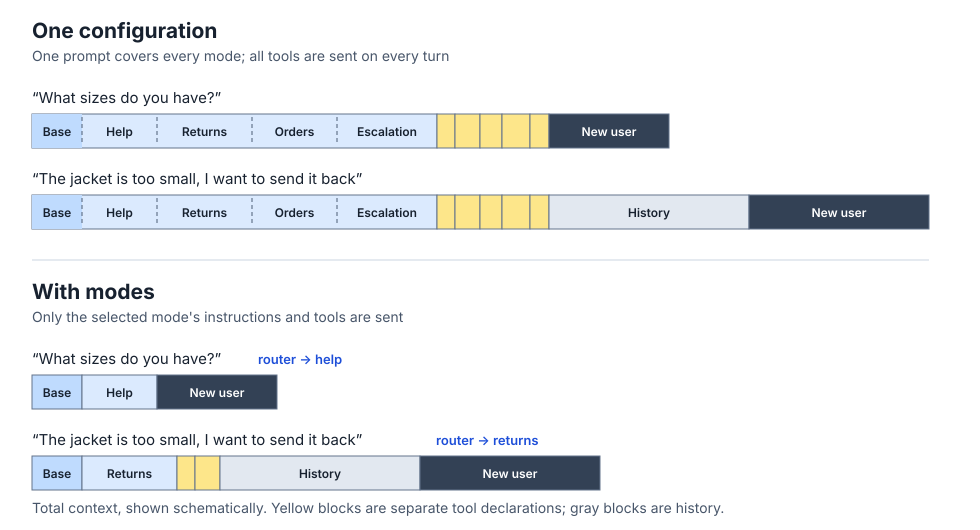

# RubyLLM::Modes

[](https://rubygems.org/gems/ruby_llm-modes)
[](https://github.com/kryzhovnik/ruby_llm-modes/actions/workflows/ci.yml)
[](#installation)

One chat, many modes: a cheap classifier picks the configuration of each turn before the answer.

Two messages in the same chat can need different configurations. A question about sizes calls for a quick answer; returning a jacket needs order lookup, return tools, and more time. With one configuration for both, every turn carries every tool description and uses the same model and effort level. Similar tools compete, and the choice of what to do stays inside the answering model, where you cannot log or test it separately.



*The diagram shows an expanded support router; the example below keeps two modes.*

A **mode** is a named configuration of one turn: instructions, tools, model, thinking. All modes share one history. Before each answer a small classifier reads the latest user message and a window of history and answers one cheap question: *which mode should take this turn?* The model that answers never sees another mode's tools or instructions. The decision is a value you can log and test: which mode, why, and what the classifier actually said. A judgment model or a small chat model answers the question in a fraction of a second, for less than the full toolset costs on every turn.

```ruby
class HelpAgent < RubyLLM::ModeAgent
  description "Answers questions about delivery, payment, sizes, and store policy."
  thinking effort: :low
  # instructions from app/prompts/help_agent/instructions.txt.erb
end

class ReturnsAgent < RubyLLM::ModeAgent
  description "Returns, exchanges, and refunds for an order the customer already has."
  tools FindOrder, CreateReturn
  thinking effort: :high
end

class SupportRouter < RubyLLM::Modes::Router
  mode HelpAgent
  mode ReturnsAgent
  fallback HelpAgent, below_confidence: 0.6
  classify_with :judge
end

chat.ask_later("The jacket is too small, I want to send it back")
route = SupportRouter.new.route(chat)
route.mode.complete

route.to_h
# {
#   "mode_name" => "returns",
#   "decided_by" => "classifier",
#   "reason" => nil,
#   "decision" => {
#     "mode_name" => "returns",
#     "confidence" => 0.88,
#     "reason" => nil,
#     "probabilities" => { "help" => 0.06, "returns" => 0.94 }
#   },
#   "duration_ms" => 351,
#   "classifier" => { "with" => "judge", "model" => "jev-1.13.0" }
# }
```

## Installation

```ruby
gem "ruby_llm-modes"
```

Requires [RubyLLM](https://rubyllm.com) 2.0 or newer and Ruby 3.2 or newer.

The `:judge` example above currently requires RubyLLM from its `main` branch; RubyLLM 2.0.0 supports `:chat`.

## Modes

A mode is a `RubyLLM::Agent` with a `description`. Subclass `RubyLLM::ModeAgent`, or extend `RubyLLM::Modes::Mode` into your own agent base class.

```ruby
class HelpAgent < RubyLLM::ModeAgent
  description <<~TEXT
    Answers questions about delivery, payment, sizes, and store policy.
    No account access: a question about a specific order is not for this mode.
  TEXT

  thinking effort: :low
end

class ReturnsAndExchangesAgent < RubyLLM::ModeAgent
  description "Returns, exchanges, and refunds for an order the customer already has. Only when the customer asks for one."
  mode_name "returns"        # optional; default derived from the class name

  tools FindOrder, CreateReturn, ExchangeItem
  thinking effort: :high
end
```

`description` tells the router what the mode does and when to pick it, as a Tool's `description` tells the model when to call the tool. `instructions` are for the model that answers, and the router never reads them. Write the description from the customer's side: what they ask for, and what is not for this mode.

A mode that declares no `description` reads `app/prompts/help_agent/description.txt.erb`, rendered without locals: the convention Agent has for `instructions`, applied to the other text. The router resolves each description when its `mode` declaration runs.

The default `mode_name` is the class name with the trailing `Agent` removed, namespaces kept, underscored: `HelpAgent` is `"help"`, `Support::HelpAgent` is `"support/help"`. Neither `description` nor `mode_name` is inherited.

A mode takes one turn of a chat that already has its own system prompt, so `instructions` in a mode defaults to `append: true, persist: false`: the mode's prompt follows the chat's and stays out of a Rails record's stored history. Declare either option to override. The defaults apply to the prompt file as well as to an explicit declaration.

One of the modes can be for clarifying questions: a short prompt, low effort, no tools, and a description like "Asks one question when the request is ambiguous on its own." It is not the fallback. The fallback takes the turn when the classifier could not choose; the clarifying mode is what the classifier chooses confidently when asking is the right answer.

## The declaration

```ruby
class SupportRouter < RubyLLM::Modes::Router
  inputs :customer, :order                  # runtime context, as in Agent

  mode HelpAgent                            # description from the class
  mode ClarifyAgent
  mode ReturnsAndExchangesAgent
  mode OrdersAgent, "Order status, tracking, and delivery dates"   # inline description wins
  mode ConciergeAgent, if: -> { customer.vip? }                    # availability per call
  mode Support::EscalationAgent, as: :escalate                     # registration name

  instructions do                           # optional; string, block, or template
    text = "Route by what the customer wants done now."
    text += "\nThe customer is looking at order #{order.number}." if order
    text
  end

  history last: 6                           # optional; default: all given
  truncate message: 30_000, history_entry: 2_000   # optional; these are the defaults
  fallback HelpAgent, below_confidence: 0.6
  classify_with :chat, model: "gemini-3.5-flash-lite"
  on_error { |error| Rails.error.report(error, handled: true) }   # optional
end
```

- `inputs` are required keywords of `new` (`order: nil` counts as passed) and become methods inside `if:` and `instructions` blocks.
- `instructions` takes the same forms as in an Agent: a string, a block, or the conventional `app/prompts/support_router/instructions.txt.erb` template with keyword locals. It resolves on the router instance, and every backend receives the same string.
- `history last: n` is how many entries before the routed message the classifier sees, system messages not counted. `history :all` is the default; it lets a subclass undo an inherited `last:`.
- `truncate` cuts the routed message to its first and last half and each history entry to its head, with a marker for the cut. `nil` disables a cap. Keep `entries × history_entry + message` under your provider's request limit.
- `fallback` is the mode used whenever the classifier is ignored (see the [outcome table](#outcomes)). Pass no threshold to accept any confidence.
- Subclassing copies the declarations. `mode` appends to the inherited list; the other macros replace.

The declaration is validated when the router is built with `new`; every problem raises `DeclarationError`.

## Routing a turn

The router reads the conversation from the chat itself. Stage the user's message with `ask_later` (RubyLLM's `ask` is `ask_later` followed by `complete`), route, then let the mode complete the turn:

```ruby
router = SupportRouter.new(customer: current_customer, order: current_order)
router.modes                    # modes available for this call

chat.ask_later(text)            # a RubyLLM::Chat, or a Rails chat record
route = router.route(chat)
route.mode.complete
```

`route` takes any object that yields its messages with `each`, as `RubyLLM::Chat`, a Rails chat record, and an agent do; the entries are `RubyLLM::Message` objects, records responding to `to_llm`, `{ role:, content: }` hashes, or plain strings in history. It leaves the system messages out, routes the last remaining entry, which must be a user message (`ArgumentError` otherwise), and gives the classifier the entries before it as history. The classifier is not called when the fallback is the only available mode.

`force` is for the turns the app has already decided, such as a button that starts a mode by name: no classifier runs, `if:` still applies, and the result is a `Route` like any other. It raises `UnknownMode` when the name is not available.

```ruby
route = router.force("returns", chat:)      # the customer pressed "Return an item"
```

## Applying a mode

`route.mode` is the mode's `Agent.new(chat: route.chat, inputs: route.inputs)`: it configures the chat the route was decided for and returns the agent wrapping it. The agent takes the inputs it declared and ignores the rest. Extra keywords go to `Agent.new` as given: `route.mode(session:)`. A `chat:` keyword is refused: the route is bound to its chat.

```ruby
route.mode.complete
```

Run the turn through the agent, not the chat, so the agent's `rescue_from` handlers apply. Agent's constructor **adds** configuration to the chat, so call `mode` once per turn: mode instructions append to the system prompt; tools, schema, and thinking are set only when the mode declares them. A chat built for the turn (a Rails chat record, or a fresh `RubyLLM.chat`) needs nothing else. A chat object reused across turns keeps the previous mode's configuration and needs a reset before the next mode.

## Backends and what `confidence` means

### `:chat`

One structured-output turn on `RubyLLM.chat(model:)`. The system prompt is a fixed frame around your `instructions`, the modes, and the conversation; the latest message is the user turn. The model returns `mode` (an enum of the available names), `confidence`, and `reason`.

`confidence` is the model's **self-report** from 0 to 1. It tells a hedge from a clear call, but it is not calibrated, and its scale depends on the model. Tune `below_confidence` per model from your logs, and do not carry a threshold from one backend to another.

`chat_factory: ->(model:) { ... }` replaces the chat constructor. The frame is not configurable: subclass `RubyLLM::Modes::Classifiers::Chat` and override `self.prompt`, or plug a custom classifier.

### `:judge`

One `RubyLLM.judge` call with a single `choice` question whose options are the modes and their descriptions. The answer is a probability per mode: the decision's `mode_name` is the most likely one and `probabilities` carries the distribution.

`confidence` comes from the judgment model with the distribution and reflects how **concentrated** it is on one mode, not a self-report. The gem passes it through as is. There is no free text, so `reason` is nil and a clarification has to be a mode of its own.

`model:` and `provider:` are passed to `RubyLLM.judge` as given; without them RubyLLM's defaults apply. `judge:` replaces `RubyLLM.judge` with any callable taking the same arguments and returning a `RubyLLM::Judgment`. `RubyLLM.judge` is not in ruby_llm 2.0.0; it is on RubyLLM's main branch. On a release without it, `classify_with :judge` raises `DeclarationError` unless `judge:` is given.

## Custom classifiers

A classifier is any object with this method:

```ruby
class KeywordClassifier
  def call(message:, history:, modes:, instructions:, inputs:)
    name = modes.map(&:name).find { |candidate| message.downcase.include?(candidate) }
    RubyLLM::Modes::Decision.new(mode_name: name, confidence: name ? 1.0 : nil, reason: "keyword match")
  end
end

classify_with KeywordClassifier.new
```

A class is accepted only if the class itself responds to `call`; the router never calls `new`. Pass `classifier:` to `route` to replace the declared backend for one call, for tests or shadow runs:

```ruby
router.route(chat, classifier: FakeClassifier.new(decision))
```

## Reference

### Classifier contract

`call(message:, history:, modes:, instructions:, inputs:)` returns a `Decision`.

- `message` is the content of the routed message, cut to the `truncate` cap.
- `history` is `[{ role:, content: }]`: the entries before the routed message, system messages left out, limited by `history last:` and cut.
- `modes` is what `router.modes` returns: the modes available on this call, each responding to `name`, `description`, and `klass`.
- `instructions` is the resolved string or nil; `inputs` is the hash passed to `new`.
- `Decision`: `mode_name` is a String or nil, `confidence` a number from 0 to 1 or nil for "not scored", `reason` and `probabilities` optional. Anything else is a `ContractError` and routes to the fallback.
- A classifier responding to `trace` is traced by its own `{ with:, model: }`; otherwise as `{ with: "custom", model: nil }`.

### Route

| Field         | Value                                                        |
|---------------|--------------------------------------------------------------|
| `mode_class`  | the agent class                                              |
| `mode_name`   | its registration name                                        |
| `decided_by`  | `:caller`, `:classifier`, or `:fallback`                  |
| `reason`      | why this mode (see below)                                    |
| `decision`    | the classifier's `Decision`, or nil when none ran            |
| `duration_ms` | classifier time, nil on caller-decided routes                |
| `classifier`  | `{ with:, model: }`, or nil when no backend was called       |

`route.chat` is the chat the route was decided for, `route.error` the exception a failed classifier raised, and `route.inputs` the router's inputs; `route.mode(**options)` is `mode_class.new(chat:, inputs:, **options)`. `to_h` is the fields above with string keys and `decided_by` as a string, minus `mode_class`; `Decision#to_h` has string keys and omits `probabilities` when nil.

### Outcomes

The route is decided by the first rule that applies:

| Situation                                     | decided_by     | reason                                 |
|-----------------------------------------------|----------------|----------------------------------------|
| `force(name, chat:)`                          | `:caller`     | `"Mode requested by caller"`           |
| only the fallback is available                | `:fallback`   | `"No other mode available"`            |
| classifier raised, or violated the contract   | `:fallback`   | `"Classifier failed: <class>: <message>"` |
| decision names an unknown or unavailable mode | `:fallback`   | `"Unknown mode <name>"`                |
| threshold on, confidence nil                  | `:fallback`   | `"Confidence not scored"`              |
| threshold on, confidence below it             | `:fallback`   | `"Below confidence threshold"`         |
| otherwise                                     | `:classifier` | the decision's reason                  |

`<message>` is the first line of the exception's message, cut at 200 characters, so a provider's error body reaches the log.

### Errors

`Router.new` raises `DeclarationError` for any problem in the declaration and says which. `route` raises `ArgumentError` when the chat has no user message to route; `force` raises `UnknownMode`, a `KeyError`. A classifier that raised, or broke the contract (a `ContractError`), does not fail the turn: the route falls back and the exception is on `route.error`. To fail instead, raise from `on_error`; whatever the handler raises escapes `route`. An exception from an `instructions` block or template is a declaration bug and escapes `route` as well.

## License

MIT. See [LICENSE.txt](LICENSE.txt).
